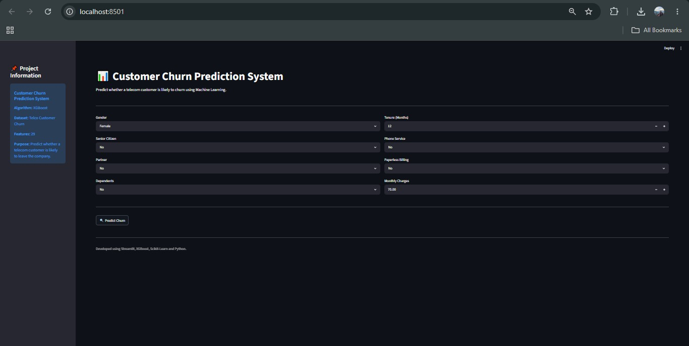
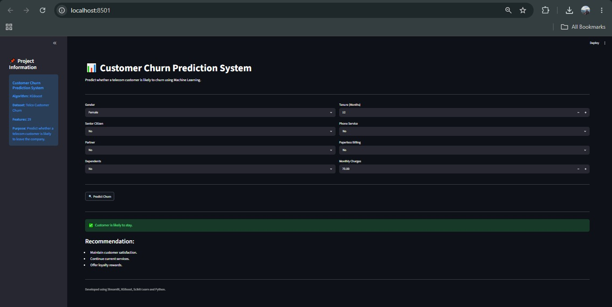
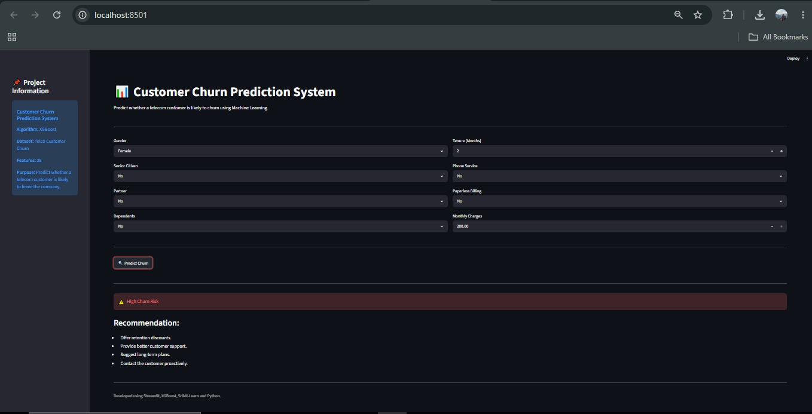

# 📉 Customer Churn Prediction System

[](https://www.python.org/)
[](https://streamlit.io/)
[](https://xgboost.readthedocs.io/)
[](https://scikit-learn.org/)
[](https://opensource.org/licenses/MIT)

An end-to-end Machine Learning project that predicts telecom customer churn using the IBM Telco Customer Churn dataset — benchmarking 8 classification models and deploying the best-performing model as a live Streamlit web application.

---

## 🚀 Live Application

🔗 **[customer-churn-prediction-krsna.streamlit.app](https://customer-churn-prediction-krsna.streamlit.app/)**

---

## 🎯 Problem Statement

Customer churn is one of the biggest challenges for telecom companies — retaining existing customers is significantly more cost-effective than acquiring new ones. This project builds a predictive pipeline to identify customers likely to leave, enabling businesses to take proactive retention action before revenue is lost.

---

## 📂 Dataset

**Source:** [IBM Telco Customer Churn — Kaggle](https://www.kaggle.com/datasets/blastchar/telco-customer-churn)

| Detail | Value |
|--------|-------|
| Total Records | 7,043 customers |
| Original Features | 20 |
| Features After Encoding | 29 |
| Target Variable | Churn (Yes / No) |

**Feature categories:**
- Demographics: Gender, Senior Citizen, Partner, Dependents
- Services: Phone, Internet, Online Security, Streaming TV/Movies
- Account Info: Tenure, Contract Type, Payment Method, Monthly Charges

---

## 🔍 Exploratory Data Analysis

Key churn drivers identified from the analysis:

- 📈 Customers with **higher monthly charges** show significantly higher churn rates
- ⏱ **Short-tenure customers** (< 12 months) are most at risk of churning
- 🌐 **Fiber optic** internet users churn more than DSL users
- 📋 **Month-to-month contracts** are the strongest churn predictor
- 💳 Customers using **electronic check** payments churn more frequently

---

## ⚙️ Project Workflow

1. Data Collection & Loading
2. Data Cleaning & Missing Value Treatment
3. Feature Engineering & Categorical Encoding
4. Exploratory Data Analysis (EDA)
5. Feature Scaling (StandardScaler)
6. Model Training & Evaluation
7. Hyperparameter Tuning (GridSearchCV)
8. Model Selection
9. Streamlit Deployment

---

## 🤖 Machine Learning Models Evaluated

| Model | Test Accuracy |
|-------|--------------|
| Logistic Regression | 75.6% |
| Random Forest | 78.0% |
| Gradient Boosting | 79.6% |
| Decision Tree | 73.5% |
| AdaBoost | 78.0% |
| K-Nearest Neighbors | 76.9% |
| Support Vector Machine | — |
| **XGBoost (Final)** | **78.6%** |

> GridSearchCV with **5-fold cross-validation** (720 fits) was applied for Gradient Boosting hyperparameter tuning.

---

## 📊 Final Model Performance — XGBoost

| Metric | Score |
|--------|-------|
| Accuracy | **78.6%** |
| Precision | **63.9%** |
| Recall | **50.6%** |
| F1 Score | **56.5%** |
| ROC-AUC | **0.84** |

---

## 🛠 Tech Stack

| Category | Tools |
|----------|-------|
| Language | Python |
| Data Analysis | Pandas, NumPy |
| Visualization | Matplotlib, Seaborn |
| Machine Learning | Scikit-learn, XGBoost |
| Deployment | Streamlit, Streamlit Cloud |
| Environment | Jupyter Notebook, Google Colab, VS Code |

---

## ✨ Application Features

✅ Real-time churn prediction from 8 customer inputs
✅ Churn risk classification — High Risk / Likely to Stay
✅ Business-oriented retention recommendations for each prediction
✅ Clean, interactive Streamlit interface
✅ XGBoost model served via pickle

---

## 📸 Application Screenshots

### 🏠 Home Page


### ✅ Customer Retention Prediction


### ⚠️ Customer Churn Prediction


---

## 📁 Project Structure

```
Customer-Churn-Prediction-System/
│
├── Customer_Churn_Prediction.ipynb   # Full ML pipeline notebook
├── app.py                            # Streamlit web application
├── churn_model.pkl                   # Trained XGBoost model
├── scaler.pkl                        # Fitted StandardScaler
├── columns.pkl                       # Feature column names
├── requirements.txt                  # Dependencies
├── Images/                           # App screenshots
└── README.md
```

---

## 📌 Business Recommendations

Generated by the app for high-risk customers:
- Offer retention discounts proactively
- Improve customer support response quality
- Encourage long-term contract sign-ups
- Provide loyalty rewards for tenure milestones
- Flag and contact high-risk accounts before contract renewal

---

## 👨‍💻 Developer

**Krishna Tiwari**
Data Analyst | Python • SQL • Power BI • Machine Learning

[](https://www.linkedin.com/in/kriishna/)
[](https://github.com/kkrishhnaa)
[](https://customer-churn-prediction-krsna.streamlit.app/)

---

⭐ *If you found this project useful, consider giving it a star.*